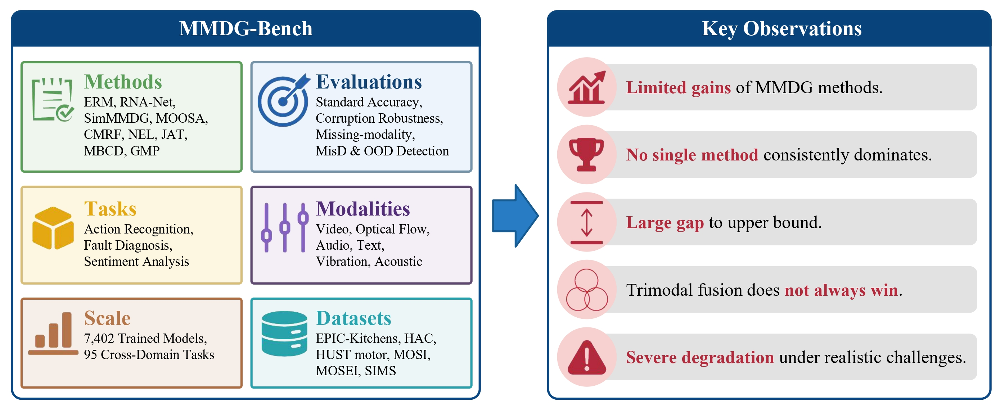

<div align="center">

<h1>Are We Making Progress in Multimodal Domain Generalization? A Comprehensive Benchmark Study</h1>

<div>
    <a href='https://sites.google.com/view/dong-hao/' target='_blank'>Hao Dong</a><sup>1</sup>
    &emsp;
    <a href='https://lihongzhao99.github.io/' target='_blank'>Hongzhao Li</a><sup>2</sup>
    &emsp;
    <a href='https://lihongzhao99.github.io/' target='_blank'>Shupan Li</a><sup>2</sup>
    &emsp;
    <a href='https://m-haris-khan.com/' target='_blank'>Muhammad Haris Khan</a><sup>3</sup>
    &emsp;
    <a href='https://chatzi.ibk.ethz.ch/about-us/people/prof-dr-eleni-chatzi.html' target='_blank'>Eleni Chatzi</a><sup>1</sup>
    &emsp;
    <a href='https://people.epfl.ch/olga.fink?lang=en' target='_blank'>Olga Fink</a><sup>4</sup>
</div>
<div>
    <sup>1</sup>ETH Zurich, <sup>2</sup>Zhengzhou University, <sup>3</sup>MBZUAI, <sup>4</sup>EPFL
</div>

<div>
    <h4 align="center">
        • <a href="https://arxiv.org/abs/2605." target='_blank'>arXiv 2026</a> •
    </h4>
</div>


<div style="text-align:center">

</div>

---

</div>

# 🌍 Multimodal Domain Generalization Benchmark


**MMDG-Bench** is the **first comprehensive and standardized benchmark** for Multimodal Domain Generalization (MMDG).

Unlike prior work that focuses on limited datasets or settings, MMDG-Bench unifies evaluation across **multiple tasks, modalities, and real-world challenges**, including corruption robustness, missing modalities, and model trustworthiness.

> 🔍 **Key insight:** Under fair and standardized evaluation, **most recent MMDG methods fail to significantly outperform strong baselines (e.g., ERM)**, suggesting that progress in MMDG may be overestimated.

### 🌟 What makes MMDG-Bench unique?

- **📊 First unified MMDG benchmark** across:
  - 6 datasets, 3 task families
  - 6 modality combinations
  - 9 methods + upper bound

- **⚖️ Standardized evaluation protocol**
  - Same data splits, hyperparameter search, model selection
  - Enables fair and reproducible comparison

- **🧪 Beyond accuracy: realistic evaluation**
  - Corruption robustness
  - Missing-modality generalization
  - Misclassification detection
  - OOD detection

- **📉 Key Findings**
  - No single method consistently dominates across datasets or modality combinations
  - Trimodal fusion does **not** consistently outperform bimodal setups
  - A large gap to upper-bound performance remains
  - Current methods are highly vulnerable to corruptions and missing modalities

This repository contains training code for multimodal domain generalization
experiments across three tasks:

- Action recognition on EPIC-Kitchens and HAC with video, audio, and optical flow.
- Fault diagnosis on the HUST motor dataset with vibration and acoustic signals.
- Sentiment analysis on CMU-MOSI, CMU-MOSEI, and CH-SIMS with text, audio, and video.

The implemented methods are ERM, RNA-Net, SimMMDG, MOOSA, CMRF, NEL, JAT,
MBCD, and GMP. Each task folder also provides a `run_all_cross_domain.sh`
script that runs a selected method over the benchmark cross-domain settings.

## Citation

If you find our work useful in your research please consider citing our [paper](https://arxiv.org/abs/2605.):


```
@article{dong2026mmdgbench,
	author   = {Dong, Hao and Li, Hongzhao and Li, Shupan and Khan, Muhammad Haris and Chatzi, Eleni and Fink, Olga},
	title    = {Are We Making Progress in Multimodal Domain Generalization? A Comprehensive Benchmark Study},
	journal  = {arXiv preprint arXiv:2605.},
	year     = {2026},
}
```

## 🗂️ Repository Layout

| Path | Purpose |
| --- | --- |
| `Action recognition/` | Action-recognition training scripts, dataloaders, MMAction2 code, VGGSound audio backbone, pretrained-model directory, and the action runner. |
| `HUSTmotor/` | HUST motor fault-diagnosis training scripts, 1D signal dataloader, preprocessing utility, models, and the HUST runner. |
| `MMSA/` | Multimodal sentiment-analysis training scripts, dataloader, fusion models, and the MMSA runner. |
| `README.md` | Public project guide. |

## 🧪 Environment

The code was developed with the following environment:

```text
Python                 3.10.19
torch                  2.0.1+cu118
torchvision            0.15.2+cu118
mmaction2              0.13.0
mmcv-full              1.2.7
numpy                  1.23.5
pandas                 1.4.2
scipy                  1.10.1
soundfile              0.11.0
```


## 📦 Data Preparation

### 🎬 Action Recognition

Download pretrained models and place them under
`Action recognition/pretrained_models/`:

| Modality | File |
| --- | --- |
| Audio | Download `H.pth.tar` from `http://www.robots.ox.ac.uk/~vgg/data/vggsound/models/H.pth.tar`, rename it to `vggsound_avgpool.pth.tar`. |
| RGB video | `slowfast_r101_8x8x1_256e_kinetics400_rgb_20210218-0dd54025.pth` from OpenMMLab. |
| Optical flow | `slowonly_r50_8x8x1_256e_kinetics400_flow_20200704-6b384243.pth` from OpenMMLab. |

Download the action-recognition datasets here:

| Dataset | Download |
| --- | --- |
| EPIC-Kitchens | [Hugging Face](https://huggingface.co/datasets/hdong51/Human-Animal-Cartoon/tree/main) |
| HAC | [Hugging Face](https://huggingface.co/datasets/hdong51/Human-Animal-Cartoon/tree/main) |


<details>
<summary><strong>EPIC-Kitchens expected layout (click to preview) 🎞️</strong></summary>

```text
DATA_ROOT/
  MM-SADA_Domain_Adaptation_Splits/
    D1_train.pkl
    D1_test.pkl
    D2_train.pkl
    D2_test.pkl
    D3_train.pkl
    D3_test.pkl
    video/train/D1/
    video/test/D1/
    flow/train/D1/
    flow/test/D1/
    audio/train/D1/*.wav
    audio/test/D1/*.wav
    ...
```

</details>


<details>
<summary><strong>HAC expected layout (click to preview) 🐶</strong></summary>

```text
DATA_ROOT/
  HAC_Splits/
    HAC_train_only_human.csv
    HAC_test_only_human.csv
    human/videos/
    human/flow/
    human/audio/
    animal/videos/
    animal/flow/
    animal/audio/
    cartoon/videos/
    cartoon/flow/
    cartoon/audio/
```

</details>

### ⚙️ HUST Motor

Download the HUST motor dataset from:

```text
https://drive.google.com/drive/folders/1XmahwIQ4o66FC3dpOaeTV-gqz2dd0XBw
```

The released HUST files are raw `TXT` signals, so you need to preprocess them
into `.mat` files before training. Training scripts read:

Place the raw TXT files under `HUSTmotor/data/`, then run:

```bash
cd HUSTmotor
python utils/HUST_preprocess.py
```

This script writes `Motor_Vib.mat` and `Motor_Aud.mat` directly into
`HUSTmotor/data/`.

### 💬 MMSA

Download CMU-MOSI, CMU-MOSEI, and CH-SIMS data from:

```text
https://drive.google.com/file/d/1tQSw1S16ujHQ069W3QTi3BJ49Q8Gya8N/view
```

The default dataloader looks for:

```text
data/mosi.pkl
data/mosei.pkl
data/sims.pkl
```

You can also pass a dataset directory or a concrete `.pkl` file path through
`--datapath`.

## 🚆 Training Scripts

All commands below should be run from the corresponding task folder. Extra
hyperparameters can be appended to any runner after `--`.

### 🎬 Action Recognition

Folder:

```bash
cd "Action recognition"
```

Single training script format:

```bash
python train_ERM.py \
  --dataset epic \
  --num_class 8 \
  -s D2 D3 \
  -t D1 \
  --use_video --use_audio \
  --datapath /path/to/DATA_ROOT
```

For EPIC, `--datapath` can point to either `DATA_ROOT/` or
`DATA_ROOT/MM-SADA_Domain_Adaptation_Splits/`.

Available method scripts:

```text
train_ERM.py
train_RNA.py
train_SimMMDG.py
train_MOOSA.py
train_CMRF.py
train_NEL.py
train_JAT.py
train_MBCD.py
train_GMP.py
```

Dataset and class-count options:

| Dataset | Domains | `--num_class` |
| --- | --- | --- |
| `epic` | `D1`, `D2`, `D3` | `8` |
| `hac` | `human`, `animal`, `cartoon` | `7` |

Supported modality combinations:

| Name | Flags |
| --- | --- |
| `va` | `--use_video --use_audio` |
| `vf` | `--use_video --use_flow` |
| `af` | `--use_audio --use_flow` |
| `vaf` | `--use_video --use_audio --use_flow` |

Batch runner:

```bash
./run_all_cross_domain.sh --method MBCD --dataset epic --setting all --modality all --datapath /path/to/DATA_ROOT
```

Runner options:

```text
--method ERM|RNA|SimMMDG|MOOSA|CMRF|NEL|JAT|MBCD|GMP
--dataset epic|hac|all
--setting multi|single|all
--modality va|vf|af|vaf|all
--datapath /path/to/DATA_ROOT
--dry-run
```

Examples:

```bash
./run_all_cross_domain.sh -m ERM -d epic -s multi -M va --dry-run
./run_all_cross_domain.sh -m JAT -d hac -s multi -M vaf -- --nepochs 10 --seed 1
./run_all_cross_domain.sh -m GMP -d all -s all -M all
```

The action runner enumerates:

| Dataset | Setting | Source -> target domains |
| --- | --- | --- |
| EPIC multi-source | `multi` | `D2,D3 -> D1`; `D1,D3 -> D2`; `D1,D2 -> D3` |
| EPIC single-source | `single` | `D1 -> D2`; `D1 -> D3`; `D2 -> D1`; `D2 -> D3`; `D3 -> D1`; `D3 -> D2` |
| HAC multi-source | `multi` | `animal,cartoon -> human`; `human,cartoon -> animal`; `human,animal -> cartoon` |
| HAC single-source | `single` | all six directed pairs among `human`, `animal`, and `cartoon` |

Outputs are written to:

```text
Action recognition/outputs/logs/{EPIC,HAC}/{METHOD}/{single_source_dg,multi_source_dg}/
Action recognition/outputs/models/{EPIC,HAC}/{METHOD}/{single_source_dg,multi_source_dg}/
```

### ⚙️ HUST Motor

Folder:

```bash
cd HUSTmotor
```

Single training script format:

```bash
python train_HUST_EMR.py -s D2 D3 D4 -t D1
```

Available method scripts:

```text
train_HUST_EMR.py
train_HUST_RNA.py
train_HUST_SimMMDG.py
train_HUST_MOOSA.py
train_HUST_CMRF.py
train_HUST_NEL.py
train_HUST_JAT.py
train_HUST_MBCD.py
train_HUST_GMP.py
```

Batch runner:

```bash
./run_all_cross_domain.sh --method GMP --setting all
```

Runner options:

```text
--method ERM|RNA|SimMMDG|MOOSA|CMRF|NEL|JAT|MBCD|GMP
--setting multi|single|all
--dry-run
```

Examples:

```bash
./run_all_cross_domain.sh -m ERM -s multi --dry-run
./run_all_cross_domain.sh -m MOOSA -s all -- --iteration 2000 --seed 1
```

The HUST runner enumerates:

| Setting | Source -> target domains |
| --- | --- |
| Multi-source | `D2,D3,D4 -> D1`; `D1,D3,D4 -> D2`; `D1,D2,D4 -> D3`; `D1,D2,D3 -> D4` |
| Single-source | all 12 directed pairs among `D1`, `D2`, `D3`, and `D4` |

Outputs are written to:

```text
HUSTmotor/outputs/logs/{METHOD}/{single_source_dg,multi_source_dg}/
HUSTmotor/outputs/models/{METHOD}/{single_source_dg,multi_source_dg}/
```

### 💬 MMSA

Folder:

```bash
cd MMSA
```

Single training script format:

```bash
python train_MMSA_ERM.py \
  --source_datasets mosi mosei \
  --target_dataset sims \
  --datapath /path/to/mmsa_data
```

Available method scripts:

```text
train_MMSA_ERM.py
train_MMSA_RNA.py
train_MMSA_SimMMDG.py
train_MMSA_MOOSA.py
train_MMSA_CMRF.py
train_MMSA_NEL.py
train_MMSA_JAT.py
train_MMSA_MBCD.py
train_MMSA_GMP.py
```

Batch runner:

```bash
./run_all_cross_domain.sh --method CMRF --setting all --datapath /path/to/mmsa_data
```

Runner options:

```text
--method ERM|RNA|SimMMDG|MOOSA|CMRF|NEL|JAT|MBCD|GMP
--setting multi|single|all
--datapath /path/to/mmsa_data
--dry-run
```

Examples:

```bash
./run_all_cross_domain.sh -m ERM -s multi --dry-run
./run_all_cross_domain.sh -m MBCD -s all --datapath ../data -- --num_epochs 5 --seed 1
```

The MMSA runner enumerates the reported benchmark settings:

| Setting | Source -> target datasets |
| --- | --- |
| Multi-source | `mosi,mosei -> sims`; `mosi,sims -> mosei` |
| Single-source | `mosei -> sims`; `mosi -> sims`; `mosi -> mosei`; `sims -> mosi`; `sims -> mosei` |

Outputs are written to:

```text
MMSA/outputs/logs/{METHOD}/{single_source_dg,multi_source_dg}/
```

## Related Projects
* [Survey](https://github.com/donghao51/Awesome-Multimodal-Adaptation): Advances in Multimodal Adaptation and Generalization: From Traditional Approaches to Foundation Models
* [SimMMDG](https://github.com/donghao51/SimMMDG): A Simple and Effective Framework for Multi-modal Domain Generalization
* [MOOSA](https://github.com/donghao51/MOOSA): Towards Multimodal Open-Set Domain Generalization and Adaptation through Self-supervision
* [JAT](https://github.com/lihongzhao99/MMDG-Joint-Adversarial-Training): Towards Robust Multimodal Domain Generalization via Modality-Domain Joint Adversarial Training
* [CMRF](https://github.com/fanyunfeng-bit/Cross-modal-Representation-Flattening-for-MMDG): Cross-modal Representation Flattening for Multi-modal Domain Generalization
* [MBCD](https://github.com/xiaohanwang01/MBCD): Modality-Balanced Collaborative Distillation for Multi-Modal Domain Generalization

## Contact

For questions, please contact:

```text
donghaospurs@gmail.com
lihongzhao@gs.zzu.edu.cn
```
