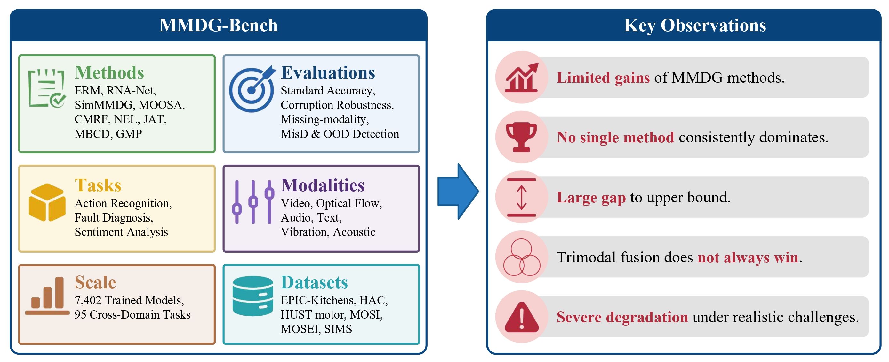

<div align="center">

<h1>Are We Making Progress in Multimodal Domain Generalization? A Comprehensive Benchmark Study</h1>

<div>
    <a href='https://sites.google.com/view/dong-hao/' target='_blank'>Hao Dong</a><sup>1</sup>
    &emsp;
    <a href='https://lihongzhao99.github.io/' target='_blank'>Hongzhao Li</a><sup>2</sup>
    &emsp;
    <a href='https://lihongzhao99.github.io/' target='_blank'>Shupan Li</a><sup>2</sup>
    &emsp;
    <a href='https://m-haris-khan.com/' target='_blank'>Muhammad Haris Khan</a><sup>3</sup>
    &emsp;
    <a href='https://chatzi.ibk.ethz.ch/about-us/people/prof-dr-eleni-chatzi.html' target='_blank'>Eleni Chatzi</a><sup>4</sup>
    &emsp;
    <a href='https://people.epfl.ch/olga.fink?lang=en' target='_blank'>Olga Fink</a><sup>5</sup>
</div>
<div>
    <sup>1</sup>ELLIS Institute Finland and Tampere University, <sup>2</sup>Zhengzhou University, <sup>3</sup>MBZUAI, <sup>4</sup>ETH Zurich, <sup>5</sup>EPFL
</div>

<div>
    <h4 align="center">
        • <a href="https://arxiv.org/abs/2605.06643" target='_blank'>NeurIPS 2026</a> •
    </h4>
</div>


<div style="text-align:center">

</div>

---

</div>

# 🌍 Multimodal Domain Generalization Benchmark


**MMDG-Bench** is the **first comprehensive and standardized benchmark** for Multimodal Domain Generalization (MMDG).

Unlike prior work that focuses on limited datasets or settings, MMDG-Bench unifies evaluation across **multiple tasks, modalities, and real-world challenges**, including corruption robustness, missing modalities, and model trustworthiness.

> 🔍 **Key insight:** Under fair and standardized evaluation, **most recent MMDG methods fail to significantly outperform strong baselines (e.g., ERM)**, suggesting that progress in MMDG may be overestimated.

### 🌟 What makes MMDG-Bench unique?

- **📊 First unified MMDG benchmark** across:
  - 6 datasets, 3 task families
  - 6 modality combinations
  - 9 methods + upper bound

- **⚖️ Standardized evaluation protocol**
  - Same data splits, hyperparameter search, model selection
  - Enables fair and reproducible comparison

- **🧪 Beyond accuracy: realistic evaluation**
  - Corruption robustness
  - Missing-modality generalization
  - Misclassification detection
  - OOD detection

- **📉 Key Findings**
  - No single method consistently dominates across datasets or modality combinations
  - Trimodal fusion does **not** consistently outperform bimodal setups
  - A large gap to upper-bound performance remains
  - Current methods are highly vulnerable to corruptions and missing modalities

This repository contains training code for multimodal domain generalization
experiments across three tasks:

- Action recognition on EPIC-Kitchens and HAC with video, audio, and optical flow.
- Fault diagnosis on the HUST motor dataset with vibration and acoustic signals.
- Sentiment analysis on CMU-MOSI, CMU-MOSEI, and CH-SIMS with text, audio, and video.

The implemented methods are ERM, RNA-Net, SimMMDG, MOOSA, CMRF, NEL, JAT,
MBCD, and GMP. Each task folder also provides a `run_all_cross_domain.sh`
script that runs a selected method over the benchmark cross-domain settings.

## Citation

If you find our work useful in your research please consider citing our [paper](https://arxiv.org/abs/2605.06643):


```
@article{dong2026mmdgbench,
	author   = {Dong, Hao and Li, Hongzhao and Li, Shupan and Khan, Muhammad Haris and Chatzi, Eleni and Fink, Olga},
	title    = {Are We Making Progress in Multimodal Domain Generalization? A Comprehensive Benchmark Study},
	journal  = {arXiv preprint arXiv:2605.06643},
	year     = {2026},
}
```

## 🗂️ Repository Layout

| Path | Purpose |
| --- | --- |
| `Action recognition/` | Action-recognition training scripts, dataloaders, MMAction2 code, VGGSound audio backbone, pretrained-model directory, and the action runner. |
| `HUSTmotor/` | HUST motor fault-diagnosis training scripts, 1D signal dataloader, preprocessing utility, models, and the HUST runner. |
| `MMSA/` | Multimodal sentiment-analysis training scripts, dataloader, fusion models, and the MMSA runner. |
| `tools/search_hparams.py` | Runs per-task hyperparameter search, model selection, and final three-seed reporting. |
| `configs/hparam_search/` | One extensible search specification per method. |
| `README.md` | Public project guide. |

## 🧪 Environment

The code was developed with the following environment:

```text
Python                 3.10.19
torch                  2.0.1+cu118
torchvision            0.15.2+cu118
mmaction2              0.13.0
mmcv-full              1.2.7
numpy                  1.23.5
pandas                 1.4.2
scipy                  1.10.1
soundfile              0.11.0
```


## 📦 Data Preparation

### 🎬 Action Recognition

Download pretrained models and place them under
`Action recognition/pretrained_models/`:

| Modality | File |
| --- | --- |
| Audio | Download `H.pth.tar` from `http://www.robots.ox.ac.uk/~vgg/data/vggsound/models/H.pth.tar`, rename it to `vggsound_avgpool.pth.tar`. |
| RGB video | `slowfast_r101_8x8x1_256e_kinetics400_rgb_20210218-0dd54025.pth` from OpenMMLab. |
| Optical flow | `slowonly_r50_8x8x1_256e_kinetics400_flow_20200704-6b384243.pth` from OpenMMLab. |

Download the action-recognition datasets here:

| Dataset | Download |
| --- | --- |
| EPIC-Kitchens | [Hugging Face](https://huggingface.co/datasets/hdong51/Human-Animal-Cartoon/tree/main) |
| HAC | [Hugging Face](https://huggingface.co/datasets/hdong51/Human-Animal-Cartoon/tree/main) |


<details>
<summary><strong>EPIC-Kitchens expected layout (click to preview) 🎞️</strong></summary>

```text
DATA_ROOT/
  MM-SADA_Domain_Adaptation_Splits/
    D1_train.pkl
    D1_test.pkl
    D2_train.pkl
    D2_test.pkl
    D3_train.pkl
    D3_test.pkl
    video/train/D1/
    video/test/D1/
    flow/train/D1/
    flow/test/D1/
    audio/train/D1/*.wav
    audio/test/D1/*.wav
    ...
```

</details>


<details>
<summary><strong>HAC expected layout (click to preview) 🐶</strong></summary>

```text
DATA_ROOT/
  HAC_Splits/
    HAC_train_only_human.csv
    HAC_test_only_human.csv
    human/videos/
    human/flow/
    human/audio/
    animal/videos/
    animal/flow/
    animal/audio/
    cartoon/videos/
    cartoon/flow/
    cartoon/audio/
```

</details>

### ⚙️ HUST Motor

Download the HUST motor dataset from:

```text
https://drive.google.com/drive/folders/1XmahwIQ4o66FC3dpOaeTV-gqz2dd0XBw
```

The released HUST files are raw `TXT` signals, so you need to preprocess them
into `.mat` files before training. Training scripts read:

Place the raw TXT files under `HUSTmotor/data/`, then run:

```bash
cd HUSTmotor
python utils/HUST_preprocess.py
```

This script writes `Motor_Vib.mat` and `Motor_Aud.mat` directly into
`HUSTmotor/data/`.

### 💬 MMSA

Download CMU-MOSI, CMU-MOSEI, and CH-SIMS data from:

```text
https://drive.google.com/file/d/1tQSw1S16ujHQ069W3QTi3BJ49Q8Gya8N/view
```

The default dataloader looks for:

```text
data/mosi.pkl
data/mosei.pkl
data/sims.pkl
```

You can also pass a dataset directory or a concrete `.pkl` file path through
`--datapath`.

## 🚀 Run Methods

After preparing the data, run any method from the repository root with the unified
runner. Each command evaluates one independent source-target-modality task and
automatically applies the paper's hyperparameter-selection protocol:

1. Run the default configuration and 10 random configurations with different seeds.
2. Select the configuration with the best source-domain validation result.
3. Rerun it with two new seeds and report the mean and standard deviation of all
   three target-domain results.

Supported methods are `ERM`, `RNA`, `SimMMDG`, `MOOSA`, `CMRF`, `NEL`, `JAT`,
`MBCD`, and `GMP`.

### Action recognition

```bash
python tools/search_hparams.py \
  --task action --method JAT --dataset epic \
  --source D2 D3 --target D1 --modality va \
  --datapath /path/to/DATA_ROOT
```

Use `epic` with domains `D1/D2/D3`, or `hac` with
`human/animal/cartoon`. Available modalities are `va`, `vf`, `af`, and `vaf`.

### HUST motor fault diagnosis

```bash
python tools/search_hparams.py \
  --task hust --method NEL \
  --source D2 D3 D4 --target D1
```

HUST data must be preprocessed under `HUSTmotor/data/` as described above.

### Multimodal sentiment analysis

```bash
python tools/search_hparams.py \
  --task mmsa --method MBCD \
  --source mosi mosei --target sims \
  --datapath /path/to/mmsa_data
```

Replace `--method`, source domains, target domain, dataset, or modality to run a
different independent task.

### Results and resuming

The selected parameters, all seeds and scores, and the final three-run statistics
are saved in:

```text
outputs/search/{task}/{dataset-or-task}/{method}/{independent-task}/search_state.json
```

The final result is under `final.mean`, with both population and sample standard
deviations under `final.std_population` and `final.std_sample`. Training logs remain
under each task folder's `outputs/logs/` directory.

Use `--search-seed N` to reproduce the generated parameters and seeds. If a run is
interrupted, repeat the same command with `--resume`; completed trials are skipped.
Add `--dry-run` only when you want to inspect the generated commands without
training.

### Adding a method

Each method owns one file under `configs/hparam_search/`. Copy an existing file and
edit its `name`, training `scripts`, and hyperparameter `space`. Optional `aliases`,
`enable_flags`, and `uses_num_modals` fields describe method-specific CLI behavior.
The search runner discovers the new method automatically.

For direct single-run training or full cross-domain enumeration without parameter
search, see the short README inside `Action recognition/`, `HUSTmotor/`, or `MMSA/`.

## Related Projects
* [Survey](https://github.com/donghao51/Awesome-Multimodal-Adaptation): Advances in Multimodal Adaptation and Generalization: From Traditional Approaches to Foundation Models
* [SimMMDG](https://github.com/donghao51/SimMMDG): A Simple and Effective Framework for Multi-modal Domain Generalization
* [MOOSA](https://github.com/donghao51/MOOSA): Towards Multimodal Open-Set Domain Generalization and Adaptation through Self-supervision
* [JAT](https://github.com/lihongzhao99/MMDG-Joint-Adversarial-Training): Towards Robust Multimodal Domain Generalization via Modality-Domain Joint Adversarial Training
* [CMRF](https://github.com/fanyunfeng-bit/Cross-modal-Representation-Flattening-for-MMDG): Cross-modal Representation Flattening for Multi-modal Domain Generalization
* [MBCD](https://github.com/xiaohanwang01/MBCD): Modality-Balanced Collaborative Distillation for Multi-Modal Domain Generalization

## Contact

For questions, please contact:

```text
donghaospurs@gmail.com
lihongzhao@gs.zzu.edu.cn
```
